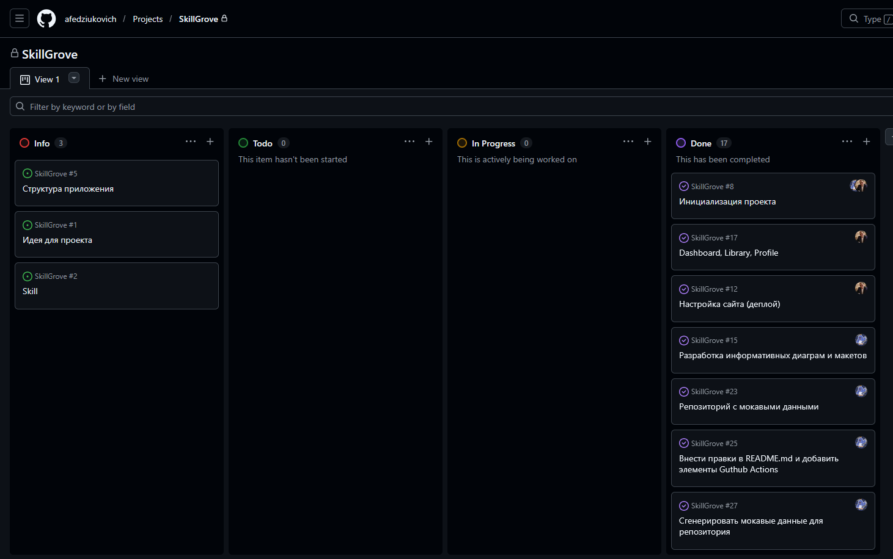

# SkillGrove

## About

**SkillGrove** is an interactive platform for preparing for technical interviews and improving JavaScript/TypeScript skills. Here, you can take tests, interact with an AI tutor, solve problems, and track your progress. The project is created as part of the final RS School assignment.

## Presentation

[View Presentation](/presentation/skillgrove-presentation.html)

## Demo Video

[Demo Video](https://youtu.be/-RK4RseYrkc) - A 2-minute video showcasing the main features and user path of the application.

## What We're Proud Of

We're proud of our team's ability to overcome the initial challenges of member departure and lack of clear leadership. Despite these obstacles, we were able to reorganize and successfully complete our project. Although it took time, we ultimately settled on a technology stack that has proven to be an excellent choice, with no regrets or doubts about our decisions. This achievement is a testament to our team's resilience, adaptability, and commitment to delivering a high-quality project.

## Deployment

To deploy the application locally, follow these steps:

1. Clone the repository using `git clone https://github.com/afedziukovich/SkillGrove.git`
2. Install dependencies using `npm install`
3. Create `.env` file using `.env.example` as example and configure it
4. Start the application using `npm run dev`

The application will be available at `http://localhost:3000`.

## Team

- Afedziukovich - [GitHub](https://github.com/afedziukovich) - [Diary](https://github.com/afedziukovich/SkillGrove/tree/main/development-notes/afedziukovich)
- Thrapis (Artsiom Belski) - [GitHub](https://github.com/Thrapis) - [Diary](https://github.com/afedziukovich/SkillGrove/tree/main/development-notes/thrapis)

## Board

[Project Board](https://github.com/users/afedziukovich/projects/1)

## Best PRs

- [refactor: migrate to nuxt](https://github.com/afedziukovich/SkillGrove/pull/20)
- [Feat/server data repository](https://github.com/afedziukovich/SkillGrove/pull/21)
- [feat(auth): implement authentication UI and pages](https://github.com/afedziukovich/SkillGrove/pull/28)
- [Feature/task solution page](https://github.com/afedziukovich/SkillGrove/pull/48)

## Meeting Notes

- [Meeting 1](https://github.com/afedziukovich/SkillGrove/tree/main/meeting-notes/meeting-2026-02-19.md)
- [Meeting 2](https://github.com/afedziukovich/SkillGrove/tree/main/meeting-notes/meeting-2026-02-21.md)
- [Meeting 3](https://github.com/afedziukovich/SkillGrove/tree/main/meeting-notes/meeting-2026-02-25.md)
- [Meeting 4](https://github.com/afedziukovich/SkillGrove/tree/main/meeting-notes/meeting-2026-03-01.md)
- [Meeting 5](https://github.com/afedziukovich/SkillGrove/tree/main/meeting-notes/meeting-2026-03-05.md)

## Checkpoint Video Evidences

- [Week 5 Checkpoint Video Evidence](https://youtu.be/Cqdfz3UE-Oo)
