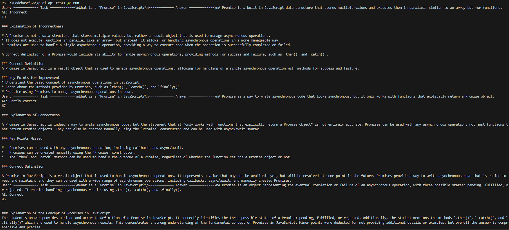

# Дата: 2026-02-22

- **Описание происходящего:** Продолжил я играться с ИИ-шкой. Настроил интерфейс для одинарных запросов к ней. Заметил поле `instructions`, в которое я могу написать инструкцию по интерпретации отправленного промпта и ответа, который он должен будет мне отправить. Имея предположение формате обмена сообщения, решил прописать данныую инструкцию. Попросил другую иишку придумать вопрос с 3 категориями подготовленного ответа: "Корректный", "Частично корректный", "Некорректный" - прогнал 3 запроса моей ИИ-решале, и тот, удивительно, сделал как я и просил (см. приложеную картину)! Ну, может ему после стоит лучше описать, как процент опыта ему объявлять, но прогресс уже есть!

  После того наш Тим Лид уже подготовил инициализацию проекта под `Vite + Vue + Pinia` (ну и линты-фигимты всякие). Проект у него почти шаблонный был, потому решил вмешаться и внести правки в его структуру. Был у меня опыт с FSD, и вот я предложил команде воспользоваться данным форматом структурированиия компонетам (проще говоря, как по папочка класть наши файлики). Настроил существующие файлики под данную методологию + настроил пару элементов, чтобы приятнее работать потом было. Тим Лиду понравилось, и нами было дадено добро на мёрдж с основной веткой проекта.

- **Затраченное время:** ~3-4 часа

